# ImGuiTester

## 概要
ImGuiTesterは、Unreal Engine 5プロジェクト上で[Dear ImGui](https://github.com/ocornut/imgui)のテスト・デモ表示するためのサンプルプロジェクトです。  
ImGuiの描画・入力制御をUE5アクター経由で行い、ウィンドウ・子ウィンドウ・各種フラグの動作確認ができます。

## 主な機能
- ImGuiウィンドウの表示・制御
- Begin/Endによるウィンドウ作成テスト
- BeginChild/EndChildによる子ウィンドウテスト
- ImGuiWindowFlagsの各種フラグ動作確認
- テストケースのON/OFF切り替えUI

## 対応環境
- Unreal Engine 5.5 以降
- Visual Studio 2022

## インストール方法
1. UE5プロジェクトの`Plugins`フォルダにImGuiプラグインを配置してください。
2. 本プロジェクトのソースを`Source/ImGuiTester`に配置します。
3. UE5エディタでプロジェクトを開き、C++ビルドを実行してください。

## 使い方
1. エディタまたはゲーム内で`AImGuiActor`をレベルに配置します。
2. 実行すると「TestMenu」ウィンドウが表示され、各テストケースのON/OFFボタンが操作できます。
3. 有効化したテストケースのウィンドウがImGui上に表示されます。

## 主要ファイル
- `Source/ImGuiTester/Private/ImGuiActor.cpp`  
  ImGuiテスト用アクターの実装
- `Source/ImGuiTester/Public/ImGuiActor.h`  
  ImGuiテスト用アクターのヘッダ
- `Plugins/ImGui/`  
  Dear ImGuiプラグイン本体

## 備考
- ImGuiプラグインの導入・設定方法は各プラグインのREADMEを参照してください。
- UE5のバージョンやプラグインの互換性にご注意ください。

### 目次

<table>
  <tr>
    <td></td>
    <td style="vertical-align:middle; padding-left:10px;">
      <a href="https://github.com/7jibi8rm/ImGuiTester/blob/master/Source/ImGuiTester/Private/ImGuiActor.cpp#L16-L32">No.1 ウィンドウ表示</a> 
      一番単純なウィンドウを表示するだけの例です。 
      ウィンドウを１つ作成し、３行分のテキストを表示します。 
    </td>
  </tr>
  <tr>
    <td>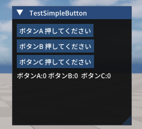</td>
    <td style="vertical-align:middle; padding-left:10px;">
      <a href="https://github.com/7jibi8rm/ImGuiTester/blob/master/Source/ImGuiTester/Private/ImGuiActor.cpp#L39-L64">No.2 ボタン作成</a> 
      単純なボタン配置の例です。 
      ウィンドウ１つにボタンを３つ配置、ボタンクリックで対応した値が変化します。 
    </td>
  </tr>
  <tr>
    <td>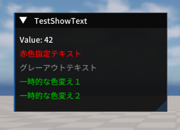</td>
    <td style="vertical-align:middle; padding-left:10px;">
      <a href="https://github.com/7jibi8rm/ImGuiTester/blob/master/Source/ImGuiTester/Private/ImGuiActor.cpp#L71-L98">No.3 様々なテキスト表示</a> 
      色変え等の特殊なテキストの例です。 
      変数の値埋め込み、グレーアウト、色指定のテキスト表示を行います。 
    </td>
  </tr>
  <tr>
    <td>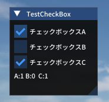</td>
    <td style="vertical-align:middle; padding-left:10px;">
      <a href="https://github.com/7jibi8rm/ImGuiTester/blob/master/Source/ImGuiTester/Private/ImGuiActor.cpp#L105-L129">No.4 チェックボックス</a> 
      チェックボックス配置の例です。 
      チェックボックスを３つ配置、状態を変数で管理し、その状態表示。 
    </td>
  </tr>
  <tr>
    <td>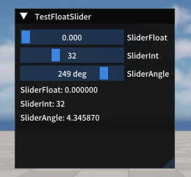</td>
    <td style="vertical-align:middle; padding-left:10px;">
      <a href="https://github.com/7jibi8rm/ImGuiTester/blob/master/Source/ImGuiTester/Private/ImGuiActor.cpp#L136-L161">No.5 スライダー</a> 
      スライダー配置の例です。 
      スライダーを３つ配置、浮動小数版・整数版・度数版の三種類。 
    </td>
  </tr>
  <tr>
    <td>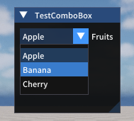</td>
    <td style="vertical-align:middle; padding-left:10px;">
      <a href="https://github.com/7jibi8rm/ImGuiTester/blob/master/Source/ImGuiTester/Private/ImGuiActor.cpp#L169-L193">No.6 コンボボックス</a> 
      コンボボックス配置の例です。 
      3項目設定したコンボボックスを１つ配置。 
      補足、コンボボックスはプルダウン・ドロップダウンリストとも呼ばれる。 
    </td>
  </tr>
  <tr>
    <td>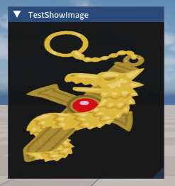</td>
    <td style="vertical-align:middle; padding-left:10px;">
      <a href="https://github.com/7jibi8rm/ImGuiTester/blob/master/Source/ImGuiTester/Private/ImGuiActor.cpp#L200-L215">No.7 テクスチャ表示</a> 
      コンテンツブラウザの画像を参照して表示する例です。 
      外部データ利用にはFImGuiModuleが必要。詳細はAImGuiActor::BeginPlayを確認。 
    </td>
  </tr>
  <tr>
    <td>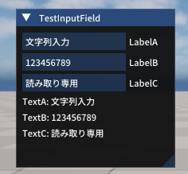</td>
    <td style="vertical-align:middle; padding-left:10px;">
      <a href="https://github.com/7jibi8rm/ImGuiTester/blob/master/Source/ImGuiTester/Private/ImGuiActor.cpp#L222-L248">No.8 ラベル付き入力フィールド</a> 
      ユーザー入力可能なテキストフィールドを表示する例です。 
      ３つの入力フィールドを配置、通常・数字のみ・読み取り専用の３種類。 
    </td>
  </tr>
  <tr>
    <td>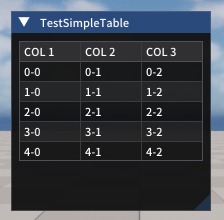</td>
    <td style="vertical-align:middle; padding-left:10px;">
      <a href="https://github.com/7jibi8rm/ImGuiTester/blob/master/Source/ImGuiTester/Private/ImGuiActor.cpp#L255-L295">No.9 テーブル</a> 
      テーブル表示の例です。 
      3列5行のテーブルを作成し、各セルに行列番号を表示します。 
    </td>
  </tr>
  <tr>
    <td>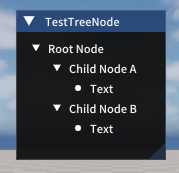</td>
    <td style="vertical-align:middle; padding-left:10px;">
      <a href="https://github.com/7jibi8rm/ImGuiTester/blob/master/Source/ImGuiTester/Private/ImGuiActor.cpp#L302-L335">No.10 ツリーノード</a> 
      ツリーノード表示の例です。 
      親ツリーと２つの子ツリー配置。ツリーノードは階層的なデータ構造の表現が可能。 
    </td>
  </tr>
  <tr>
    <td>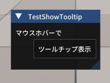</td>
    <td style="vertical-align:middle; padding-left:10px;">
      <a href="https://github.com/7jibi8rm/ImGuiTester/blob/master/Source/ImGuiTester/Private/ImGuiActor.cpp#L342-L363">No.11 ツールチップ表示</a> 
      ツールチップを表示させる例です。 
      アイテムにマウスホバーでツールチップを表示。別名ポップアップヒント。 
    </td>
  </tr>
  <tr>
    <td>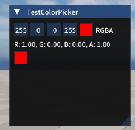</td>
    <td style="vertical-align:middle; padding-left:10px;">
      <a href="https://github.com/7jibi8rm/ImGuiTester/blob/master/Source/ImGuiTester/Private/ImGuiActor.cpp#L368-L389">No.12 カラー選択ダイアログを表示</a> 
    </td>
  </tr>
  <tr>
    <td>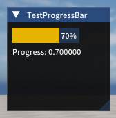</td>
    <td style="vertical-align:middle; padding-left:10px;">
      <a href="https://github.com/7jibi8rm/ImGuiTester/blob/master/Source/ImGuiTester/Private/ImGuiActor.cpp#L394-L413">No.13 プログレスバーを表示</a> 
    </td>
  </tr>
  <tr>
    <td>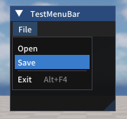</td>
    <td style="vertical-align:middle; padding-left:10px;">
      <a href="https://github.com/7jibi8rm/ImGuiTester/blob/master/Source/ImGuiTester/Private/ImGuiActor.cpp#L418-L456">No.14 メニューバーを作成する</a> 
    </td>
  </tr>
  <tr>
    <td>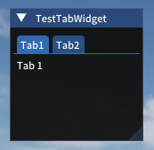</td>
    <td style="vertical-align:middle; padding-left:10px;">
      <a href="https://github.com/7jibi8rm/ImGuiTester/blob/master/Source/ImGuiTester/Private/ImGuiActor.cpp#L461-L491">No.15 タブを作成する</a> 
    </td>
  </tr>
  <tr>
    <td>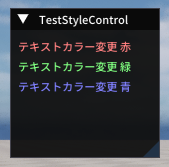</td>
    <td style="vertical-align:middle; padding-left:10px;">
      <a href="https://github.com/7jibi8rm/ImGuiTester/blob/master/Source/ImGuiTester/Private/ImGuiActor.cpp#L497-L526">No.16 スタイルを変更する</a> 
    </td>
  </tr>
  <tr>
    <td>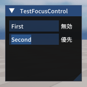</td>
    <td style="vertical-align:middle; padding-left:10px;">
      <a href="https://github.com/7jibi8rm/ImGuiTester/blob/master/Source/ImGuiTester/Private/ImGuiActor.cpp#L531-L554">No.17 フォーカス制御</a> 
    </td>
  </tr>
  <tr>
    <td>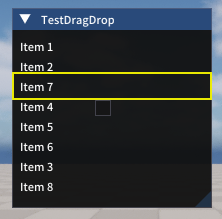</td>
    <td style="vertical-align:middle; padding-left:10px;">
      <a href="https://github.com/7jibi8rm/ImGuiTester/blob/master/Source/ImGuiTester/Private/ImGuiActor.cpp#L559-L608">No.18 ドラッグ&ドロップを実装する</a> 
    </td>
  </tr>
  <tr>
    <td>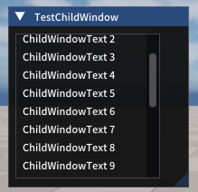</td>
    <td style="vertical-align:middle; padding-left:10px;">
      <a href="https://github.com/7jibi8rm/ImGuiTester/blob/master/Source/ImGuiTester/Private/ImGuiActor.cpp#L613-L635">No.19 子ウィンドウ・領域を作る</a> 
    </td>
  </tr>
  <tr>
    <td>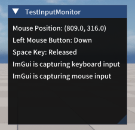</td>
    <td style="vertical-align:middle; padding-left:10px;">
      <a href="https://github.com/7jibi8rm/ImGuiTester/blob/master/Source/ImGuiTester/Private/ImGuiActor.cpp#L640-L673">No.20 入力状態を監視</a> 
    </td>
  </tr>
  <tr>
    <td>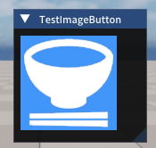</td>
    <td style="vertical-align:middle; padding-left:10px;">
      <a href="https://github.com/7jibi8rm/ImGuiTester/blob/master/Source/ImGuiTester/Private/ImGuiActor.cpp#L678-L681">No.21 画像ボタンを設置</a> 
    </td>
  </tr>
  <tr>
    <td>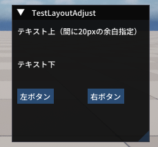</td>
    <td style="vertical-align:middle; padding-left:10px;">
      <a href="https://github.com/7jibi8rm/ImGuiTester/blob/master/Source/ImGuiTester/Private/ImGuiActor.cpp#L686-L709">No.22 レイアウトをスペースで調整</a> 
    </td>
  </tr>
  <tr>
    <td>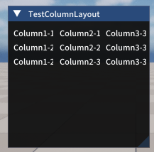</td>
    <td style="vertical-align:middle; padding-left:10px;">
      <a href="https://github.com/7jibi8rm/ImGuiTester/blob/master/Source/ImGuiTester/Private/ImGuiActor.cpp#L714-L738">No.23 行や列を分割配置</a> 
    </td>
  </tr>
  <tr>
    <td>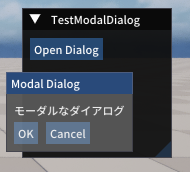</td>
    <td style="vertical-align:middle; padding-left:10px;">
      <a href="https://github.com/7jibi8rm/ImGuiTester/blob/master/Source/ImGuiTester/Private/ImGuiActor.cpp#L743-L780">No.24 モーダルダイアログを表示</a> 
    </td>
  </tr>
  <tr>
    <td></td>
    <td style="vertical-align:middle; padding-left:10px;">
      <a href="https://github.com/7jibi8rm/ImGuiTester/blob/master/Source/ImGuiTester/Private/ImGuiActor.cpp#L785-L802">No.25 ウィンドウの位置・サイズ固定</a> 
    </td>
  </tr>
  <tr>
    <td>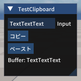</td>
    <td style="vertical-align:middle; padding-left:10px;">
      <a href="https://github.com/7jibi8rm/ImGuiTester/blob/master/Source/ImGuiTester/Private/ImGuiActor.cpp#L807-L843">No.26 データをコピー&ペースト</a> 
    </td>
  </tr>
  <tr>
    <td>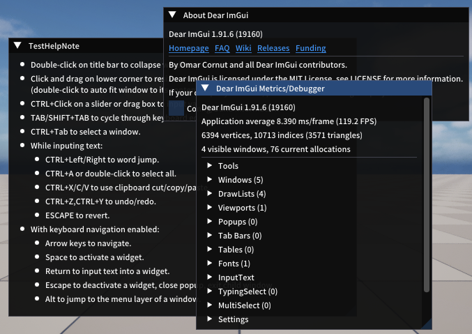</td>
    <td style="vertical-align:middle; padding-left:10px;">
      <a href="https://github.com/7jibi8rm/ImGuiTester/blob/master/Source/ImGuiTester/Private/ImGuiActor.cpp#L848-L864">No.27 ノートやヘルプウィンドウ</a> 
    </td>
  </tr>
  <tr>
    <td>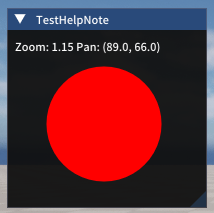</td>
    <td style="vertical-align:middle; padding-left:10px;">
      <a href="https://github.com/7jibi8rm/ImGuiTester/blob/master/Source/ImGuiTester/Private/ImGuiActor.cpp#L869-L910">No.28 ズーム/パン操作</a> 
    </td>
  </tr>
  <tr>
    <td></td>
    <td style="vertical-align:middle; padding-left:10px;">
      <a href="https://github.com/7jibi8rm/ImGuiTester/blob/master/Source/ImGuiTester/Private/ImGuiActor.cpp#L915-L952">No.29 順序入替リストボックス</a> 
    </td>
  </tr>
  <tr>
    <td>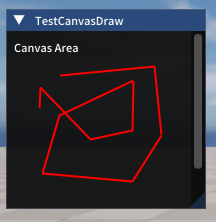</td>
    <td style="vertical-align:middle; padding-left:10px;">
      <a href="https://github.com/7jibi8rm/ImGuiTester/blob/master/Source/ImGuiTester/Private/ImGuiActor.cpp#L957-L998">No.30 キャンバス描画</a> 
    </td>
  </tr>
  <tr>
    <td>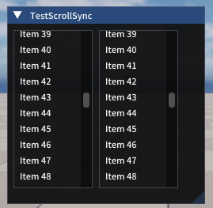</td>
    <td style="vertical-align:middle; padding-left:10px;">
      <a href="https://github.com/7jibi8rm/ImGuiTester/blob/master/Source/ImGuiTester/Private/ImGuiActor.cpp#L1003-L1054">No.31 スクロール同期</a> 
    </td>
  </tr>
  <tr>
    <td></td>
    <td style="vertical-align:middle; padding-left:10px;">
      <a href="https://github.com/7jibi8rm/ImGuiTester/blob/master/Source/ImGuiTester/Private/ImGuiActor.cpp#L1059-L1082">No.32 タイムライン（進捗付きバー）</a> 
    </td>
  </tr>
  <tr>
    <td>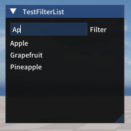</td>
    <td style="vertical-align:middle; padding-left:10px;">
      <a href="https://github.com/7jibi8rm/ImGuiTester/blob/master/Source/ImGuiTester/Private/ImGuiActor.cpp#L1087-L1118">No.33 フィルタリングリスト</a> 
    </td>
  </tr>
  <tr>
    <td>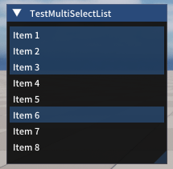</td>
    <td style="vertical-align:middle; padding-left:10px;">
      <a href="https://github.com/7jibi8rm/ImGuiTester/blob/master/Source/ImGuiTester/Private/ImGuiActor.cpp#L1123-L1165">No.34 複数選択リストボックス</a> 
    </td>
  </tr>
  <tr>
    <td>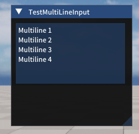</td>
    <td style="vertical-align:middle; padding-left:10px;">
      <a href="https://github.com/7jibi8rm/ImGuiTester/blob/master/Source/ImGuiTester/Private/ImGuiActor.cpp#L1170-L1188">No.35 マルチライン入力</a> 
    </td>
  </tr>
  <tr>
    <td>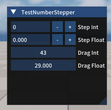</td>
    <td style="vertical-align:middle; padding-left:10px;">
      <a href="https://github.com/7jibi8rm/ImGuiTester/blob/master/Source/ImGuiTester/Private/ImGuiActor.cpp#L1193-L1212">No.36 数値ステッパー</a> 
    </td>
  </tr>
  <tr>
    <td></td>
    <td style="vertical-align:middle; padding-left:10px;">
      <a href="https://github.com/7jibi8rm/ImGuiTester/blob/master/Source/ImGuiTester/Private/ImGuiActor.cpp#L1217-L1236">No.37 色変更UI</a> 
    </td>
  </tr>
  <tr>
    <td>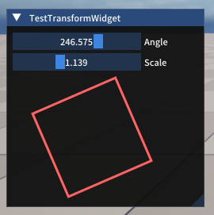</td>
    <td style="vertical-align:middle; padding-left:10px;">
      <a href="https://github.com/7jibi8rm/ImGuiTester/blob/master/Source/ImGuiTester/Private/ImGuiActor.cpp#L1241-L1289">No.38 回転/スケールUI</a> 
    </td>
  </tr>
  <tr>
    <td>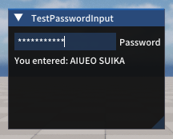</td>
    <td style="vertical-align:middle; padding-left:10px;">
      <a href="https://github.com/7jibi8rm/ImGuiTester/blob/master/Source/ImGuiTester/Private/ImGuiActor.cpp#L1294-L1313">No.39 パスワード入力</a> 
    </td>
  </tr>
  <tr>
    <td></td>
    <td style="vertical-align:middle; padding-left:10px;">
      <a href="https://github.com/7jibi8rm/ImGuiTester/blob/master/Source/ImGuiTester/Private/ImGuiActor.cpp#L1318-L1341">No.40 ホバー時詳細情報</a> 
    </td>
  </tr>
  <tr>
    <td></td>
    <td style="vertical-align:middle; padding-left:10px;">
      <a href="https://github.com/7jibi8rm/ImGuiTester/blob/master/Source/ImGuiTester/Private/ImGuiActor.cpp#L1346-L1365">No.41 物理スライダー操作</a> 
    </td>
  </tr>
  <tr>
    <td></td>
    <td style="vertical-align:middle; padding-left:10px;">
      <a href="https://github.com/7jibi8rm/ImGuiTester/blob/master/Source/ImGuiTester/Private/ImGuiActor.cpp#L1370-L1373">No.42 音声再生UI</a> 
    </td>
  </tr>
  <tr>
    <td></td>
    <td style="vertical-align:middle; padding-left:10px;">
      <a href="https://github.com/7jibi8rm/ImGuiTester/blob/master/Source/ImGuiTester/Private/ImGuiActor.cpp#L1378-L1381">No.43 ビデオ埋め込みUI</a> 
    </td>
  </tr>
  <tr>
    <td>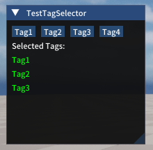</td>
    <td style="vertical-align:middle; padding-left:10px;">
      <a href="https://github.com/7jibi8rm/ImGuiTester/blob/master/Source/ImGuiTester/Private/ImGuiActor.cpp#L1386-L1431">No.44 タグ選択UI</a> 
    </td>
  </tr>
  <tr>
    <td></td>
    <td style="vertical-align:middle; padding-left:10px;">
      <a href="https://github.com/7jibi8rm/ImGuiTester/blob/master/Source/ImGuiTester/Private/ImGuiActor.cpp#L1436-L1458">No.45 ヘッダーで折りたたみ</a> 
    </td>
  </tr>
  <tr>
    <td>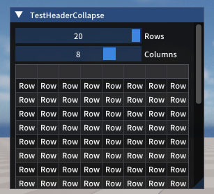</td>
    <td style="vertical-align:middle; padding-left:10px;">
      <a href="https://github.com/7jibi8rm/ImGuiTester/blob/master/Source/ImGuiTester/Private/ImGuiActor.cpp#L1463-L1505">No.46 行数・カラム数変更可能テーブル</a> 
    </td>
  </tr>
  <tr>
    <td></td>
    <td style="vertical-align:middle; padding-left:10px;">
      <a href="https://github.com/7jibi8rm/ImGuiTester/blob/master/Source/ImGuiTester/Private/ImGuiActor.cpp#L1510-L1514">No.47 ツールバー作成</a> 
    </td>
  </tr>
  <tr>
    <td>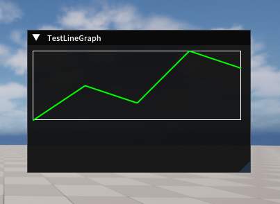</td>
    <td style="vertical-align:middle; padding-left:10px;">
      <a href="https://github.com/7jibi8rm/ImGuiTester/blob/master/Source/ImGuiTester/Private/ImGuiActor.cpp#L1521-L1561">No.48 折れ線グラフ</a> 
      ImDrawListを使ってウィンドウ内に折れ線グラフを描画します。 
      カスタム描画の工夫によりグラフを実現しています。グラフ機能が存在するわけではありません。 
    </td>
  </tr>
  <tr>
    <td>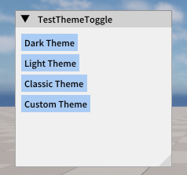</td>
    <td style="vertical-align:middle; padding-left:10px;">
      <a href="https://github.com/7jibi8rm/ImGuiTester/blob/master/Source/ImGuiTester/Private/ImGuiActor.cpp#L1568-L1609">No.49 テーマ切替</a> 
      テーマ切り替え用メソッドのテストです。 
      ダーク・ライト・クラシック・カスタムテーマの4種類への切り替えを行います。 
    </td>
  </tr>
  <tr>
    <td>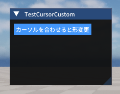</td>
    <td style="vertical-align:middle; padding-left:10px;">
      <a href="https://github.com/7jibi8rm/ImGuiTester/blob/master/Source/ImGuiTester/Private/ImGuiActor.cpp#L1617-L1643">No.50 マウスカーソルカスタマイズ</a> 
      マウスカーソルの形を変更する方法の例です。 
      ホバー時は左右リサイズ用のカーソル、通常時は矢印カーソルを表示します。 
      ImGui::SetMouseCursor()によりカーソル形状を変更しています。 
    </td>
  </tr>
  <tr>
    <td>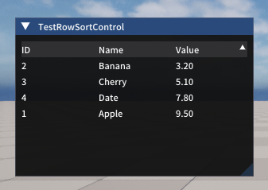</td>
    <td style="vertical-align:middle; padding-left:10px;">
      <a href="https://github.com/7jibi8rm/ImGuiTester/blob/master/Source/ImGuiTester/Private/ImGuiActor.cpp#L1651-L1720">No.51 行の並び替え</a> 
      テーブルソート機能を利用したシンプルなサンプル。 
      ソート可能なテーブルで行データ（ID・名前・値）を表示します。 
      ヘッダークリックで昇順・降順の並び替えができます。 
    </td>
  </tr>
</table>

