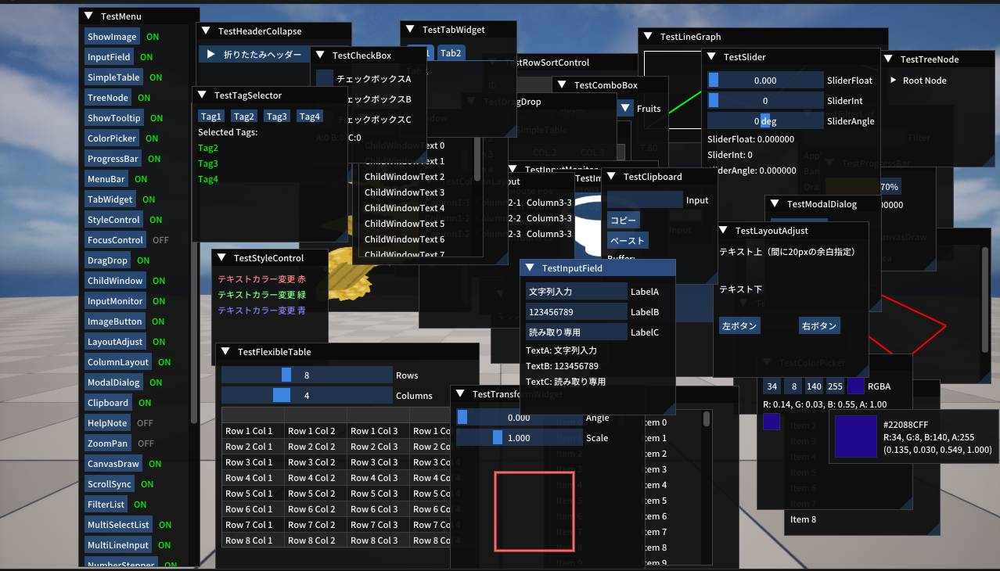
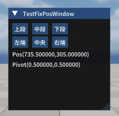

# ImGuiTester

ImGuiTesterは、UE5上でImGuiのテスト・流用を目的としたサンプルコード集です。

## 動作環境
- Unreal Engine 5.5.4
- VisualStudio 2022

### 使用しているImGuiについて
- [Unreal ImGuiプラグイン (benui-dev/UnrealImGui)：MIT License](https://github.com/benui-dev/UnrealImGui)  
  Unreal Engine 5 向けに Dear ImGui を統合するプラグイン。ImPlotなどの拡張にも対応。

- [Dear ImGui (Omar Cornut)：MIT License](https://github.com/ocornut/imgui)  
  軽量で移植性の高いGUIライブラリ。Unreal ImGuiはこのライブラリをUnreal Engineに対応させたもの。

## 主要ファイル
- `Source/ImGuiTester/Private/ImGuiActor.cpp`  
  ImGuiテスト用アクターの実装。サンプルコードは全てここ。
- `Plugins/ImGui/`  
  ImGuiプラグイン本体。日本語化対応のため一部変更を加えています。

## サンプルコード解説
- タイトルリンクからサンプルコードの場所に移動できます。

<table>
  <tr>
    <td></td>
    <td style="vertical-align:middle; padding-left:10px;">
      <a href="https://github.com/7jibi8rm/ImGuiTester/blob/master/Source/ImGuiTester/Private/ImGuiActor.cpp#L15-L31">No.1 ウィンドウ表示</a> 
      一番単純なウィンドウを表示するだけの例です。 
      ウィンドウを１つ作成し、３行分のテキストを表示します。 
    </td>
  </tr>
  <tr>
    <td></td>
    <td style="vertical-align:middle; padding-left:10px;">
      <a href="https://github.com/7jibi8rm/ImGuiTester/blob/master/Source/ImGuiTester/Private/ImGuiActor.cpp#L38-L63">No.2 ボタン作成</a> 
      単純なボタン配置の例です。 
      ウィンドウ１つにボタンを３つ配置、ボタンクリックで対応した値が変化します。 
    </td>
  </tr>
  <tr>
    <td></td>
    <td style="vertical-align:middle; padding-left:10px;">
      <a href="https://github.com/7jibi8rm/ImGuiTester/blob/master/Source/ImGuiTester/Private/ImGuiActor.cpp#L69-L96">No.3 様々なテキスト表示</a> 
      色変え等の特殊なテキストの例です。 
      変数の値埋め込み、グレーアウト、色指定のテキスト表示を行います。 
    </td>
  </tr>
  <tr>
    <td></td>
    <td style="vertical-align:middle; padding-left:10px;">
      <a href="https://github.com/7jibi8rm/ImGuiTester/blob/master/Source/ImGuiTester/Private/ImGuiActor.cpp#L103-L151">No.4 固定位置にウィンドウを表示する</a> 
      スクリーン中央・四隅にウィンドウを固定表示する例 
      直近のウィンドウ座標指定で位置を固定、ボタンで位置変更。 
    </td>
  </tr>
  <tr>
    <td></td>
    <td style="vertical-align:middle; padding-left:10px;">
      <a href="https://github.com/7jibi8rm/ImGuiTester/blob/master/Source/ImGuiTester/Private/ImGuiActor.cpp#L158-L182">No.5 チェックボックス</a> 
      チェックボックス配置の例です。 
      チェックボックスを３つ配置、状態を変数で管理し、その状態表示。 
    </td>
  </tr>
  <tr>
    <td></td>
    <td style="vertical-align:middle; padding-left:10px;">
      <a href="https://github.com/7jibi8rm/ImGuiTester/blob/master/Source/ImGuiTester/Private/ImGuiActor.cpp#L189-L214">No.6 スライダー</a> 
      スライダー配置の例です。 
      スライダーを３つ配置、浮動小数版・整数版・度数版の三種類。 
    </td>
  </tr>
  <tr>
    <td></td>
    <td style="vertical-align:middle; padding-left:10px;">
      <a href="https://github.com/7jibi8rm/ImGuiTester/blob/master/Source/ImGuiTester/Private/ImGuiActor.cpp#L222-L246">No.7 コンボボックス</a> 
      コンボボックス配置の例です。 
      3項目設定したコンボボックスを１つ配置。 
      補足、コンボボックスはプルダウン・ドロップダウンリストとも呼ばれる。 
    </td>
  </tr>
  <tr>
    <td></td>
    <td style="vertical-align:middle; padding-left:10px;">
      <a href="https://github.com/7jibi8rm/ImGuiTester/blob/master/Source/ImGuiTester/Private/ImGuiActor.cpp#L252-L267">No.8 テクスチャ表示</a> 
      コンテンツブラウザの画像を参照して表示する例です。 
      外部データ利用にはFImGuiModuleが必要。詳細はAImGuiActor::BeginPlayを確認。 
    </td>
  </tr>
  <tr>
    <td></td>
    <td style="vertical-align:middle; padding-left:10px;">
      <a href="https://github.com/7jibi8rm/ImGuiTester/blob/master/Source/ImGuiTester/Private/ImGuiActor.cpp#L274-L300">No.9 ラベル付き入力フィールド</a> 
      ユーザー入力可能なテキストフィールドを表示する例です。 
      ３つの入力フィールドを配置、通常・数字のみ・読み取り専用の３種類。 
    </td>
  </tr>
  <tr>
    <td></td>
    <td style="vertical-align:middle; padding-left:10px;">
      <a href="https://github.com/7jibi8rm/ImGuiTester/blob/master/Source/ImGuiTester/Private/ImGuiActor.cpp#L307-L347">No.10 テーブル</a> 
      テーブル表示の例です。 
      3列5行のテーブルを作成し、各セルに行列番号を表示します。 
    </td>
  </tr>
  <tr>
    <td></td>
    <td style="vertical-align:middle; padding-left:10px;">
      <a href="https://github.com/7jibi8rm/ImGuiTester/blob/master/Source/ImGuiTester/Private/ImGuiActor.cpp#L353-L386">No.11 ツリーノード</a> 
      ツリーノード表示の例です。 
      親ツリーと２つの子ツリー配置。ツリーノードは階層的なデータ構造の表現が可能。 
    </td>
  </tr>
  <tr>
    <td></td>
    <td style="vertical-align:middle; padding-left:10px;">
      <a href="https://github.com/7jibi8rm/ImGuiTester/blob/master/Source/ImGuiTester/Private/ImGuiActor.cpp#L393-L414">No.12 ツールチップ表示</a> 
      ツールチップを表示させる例です。 
      アイテムにマウスホバーでツールチップを表示。別名ポップアップヒント。 
    </td>
  </tr>
  <tr>
    <td></td>
    <td style="vertical-align:middle; padding-left:10px;">
      <a href="https://github.com/7jibi8rm/ImGuiTester/blob/master/Source/ImGuiTester/Private/ImGuiActor.cpp#L421-L447">No.13 カラーピッカー</a> 
      カラー選択メニューの例です。 
      RGBA各成分を調整可能なカラーピッカー・プレビュー表示を配置。 
    </td>
  </tr>
  <tr>
    <td></td>
    <td style="vertical-align:middle; padding-left:10px;">
      <a href="https://github.com/7jibi8rm/ImGuiTester/blob/master/Source/ImGuiTester/Private/ImGuiActor.cpp#L454-L474">No.14 プログレスバー</a> 
      プログレスバー表示の例です。 
      進捗率を表すプログレスバーを配置、進捗率は0.0〜1.0の範囲で指定。 
    </td>
  </tr>
  <tr>
    <td></td>
    <td style="vertical-align:middle; padding-left:10px;">
      <a href="https://github.com/7jibi8rm/ImGuiTester/blob/master/Source/ImGuiTester/Private/ImGuiActor.cpp#L482-L520">No.15 メニューバー追加</a> 
      ウィンドウにメニューバーを追加する例です。 
      ImGui::Beginにて、ImGuiWindowFlags_MenuBarを指定することでメニューバーを有効化。 
      メニューバーに「File」を追加し、その中に複数のアイテムを配置。 
    </td>
  </tr>
  <tr>
    <td></td>
    <td style="vertical-align:middle; padding-left:10px;">
      <a href="https://github.com/7jibi8rm/ImGuiTester/blob/master/Source/ImGuiTester/Private/ImGuiActor.cpp#L527-L557">No.16 タブバー</a> 
      タブ付きウィンドウを作成する例です。 
      タブバーを追加し２つのタブを配置。それぞれ内容を変化。 
    </td>
  </tr>
  <tr>
    <td></td>
    <td style="vertical-align:middle; padding-left:10px;">
      <a href="https://github.com/7jibi8rm/ImGuiTester/blob/master/Source/ImGuiTester/Private/ImGuiActor.cpp#L565-L594">No.17 スタイル変更</a> 
      ImGui内の様々なスタイルを変更する例です。 
      テキストカラーの変更を行います。他にも色々出来そうだが深追いしきれず…。要調査。 
    </td>
  </tr>
  <tr>
    <td></td>
    <td style="vertical-align:middle; padding-left:10px;">
      <a href="https://github.com/7jibi8rm/ImGuiTester/blob/master/Source/ImGuiTester/Private/ImGuiActor.cpp#L602-L626">No.18 フォーカス制御</a> 
      片方の入力フィールドを優先フォーカスする例です。 
      フォーカス関数は多々あるため、一番単純なキーボードのフォーカス制御を対応。 
      その他の応用的な制御は要調査。 
    </td>
  </tr>
  <tr>
    <td></td>
    <td style="vertical-align:middle; padding-left:10px;">
      <a href="https://github.com/7jibi8rm/ImGuiTester/blob/master/Source/ImGuiTester/Private/ImGuiActor.cpp#L633-L682">No.19 ドラッグ&ドロップ</a> 
      ドラッグ&ドロップの実装例です。 
      アイテムリストをドラッグ&ドロップで並び替え可能にしています。 
    </td>
  </tr>
  <tr>
    <td></td>
    <td style="vertical-align:middle; padding-left:10px;">
      <a href="https://github.com/7jibi8rm/ImGuiTester/blob/master/Source/ImGuiTester/Private/ImGuiActor.cpp#L689-L711">No.20 子ウィンドウ作成</a> 
      ウィンドウの中に子ウィンドウを作成する例です。 
      子ウィンドウはスクロール操作や、その中でUI要素を独立して管理できます。 
    </td>
  </tr>
  <tr>
    <td></td>
    <td style="vertical-align:middle; padding-left:10px;">
      <a href="https://github.com/7jibi8rm/ImGuiTester/blob/master/Source/ImGuiTester/Private/ImGuiActor.cpp#L718-L751">No.21 キーボード・マウス入力監視</a> 
      入力状態を監視する例です。 
      マウス位置、ボタン状態、キー押下状態を取得し表示します。 
    </td>
  </tr>
  <tr>
    <td></td>
    <td style="vertical-align:middle; padding-left:10px;">
      <a href="https://github.com/7jibi8rm/ImGuiTester/blob/master/Source/ImGuiTester/Private/ImGuiActor.cpp#L758-L787">No.22 画像ボタン</a> 
      画像付きボタンを配置する例です。 
      コンテンツブラウザの画像をテクスチャとして登録し、それをボタンに割り当てます。 
    </td>
  </tr>
  <tr>
    <td></td>
    <td style="vertical-align:middle; padding-left:10px;">
      <a href="https://github.com/7jibi8rm/ImGuiTester/blob/master/Source/ImGuiTester/Private/ImGuiActor.cpp#L794-L819">No.23 スペース調整</a> 
      ウィンドウ内のスペース調整の例です。 
      縦横のスペース調整、同一ライン配置を行います。 
    </td>
  </tr>
  <tr>
    <td></td>
    <td style="vertical-align:middle; padding-left:10px;">
      <a href="https://github.com/7jibi8rm/ImGuiTester/blob/master/Source/ImGuiTester/Private/ImGuiActor.cpp#L826-L856">No.24 行や列を分割配置</a> 
      カラムレイアウトの例です。 
      ウィンドウ内に3列レイアウトを作成し、各列にテキストを配置します。 
    </td>
  </tr>
  <tr>
    <td></td>
    <td style="vertical-align:middle; padding-left:10px;">
      <a href="https://github.com/7jibi8rm/ImGuiTester/blob/master/Source/ImGuiTester/Private/ImGuiActor.cpp#L863-L900">No.25 モーダルダイアログ</a> 
      ポップアップで出現するダイアログの例です。 
      ボタンを押すと優先フォーカスされたダイアログが表示されます。 
    </td>
  </tr>
  <tr>
    <td></td>
    <td style="vertical-align:middle; padding-left:10px;">
      <a href="https://github.com/7jibi8rm/ImGuiTester/blob/master/Source/ImGuiTester/Private/ImGuiActor.cpp#L907-L943">No.26 コピー&ペースト</a> 
      クリップボードを利用したコピー&ペーストの例です。 
      入力フィールドの文字列をクリップボードにコピーします。 
    </td>
  </tr>
  <tr>
    <td></td>
    <td style="vertical-align:middle; padding-left:10px;">
      <a href="https://github.com/7jibi8rm/ImGuiTester/blob/master/Source/ImGuiTester/Private/ImGuiActor.cpp#L950-L968">No.27 ユーザーガイド表示</a> 
      ImGuiのユーザーガイドを表示する例です。 
      ヘルプメニューとして利用可能。ImGuiの基本的な操作方法が記載されています。 
    </td>
  </tr>
  <tr>
    <td></td>
    <td style="vertical-align:middle; padding-left:10px;">
      <a href="https://github.com/7jibi8rm/ImGuiTester/blob/master/Source/ImGuiTester/Private/ImGuiActor.cpp#L976-L1017">No.28 ズーム/パン操作</a> 
      ズームとパン操作の例です。 
      マウスホイールでズームイン・ズームアウト、右ドラッグでパン操作が可能です。 
      描画領域に円を描画し、ズームとパンを反映します。 
    </td>
  </tr>
  <tr>
    <td></td>
    <td style="vertical-align:middle; padding-left:10px;">
      <a href="https://github.com/7jibi8rm/ImGuiTester/blob/master/Source/ImGuiTester/Private/ImGuiActor.cpp#L1024-L1065">No.29 キャンバス描画</a> 
      ウィンドウ上にラインを描画する例です。 
      マウスクリックでポイントを追加し、ポイントを直線で結びます。 
    </td>
  </tr>
  <tr>
    <td></td>
    <td style="vertical-align:middle; padding-left:10px;">
      <a href="https://github.com/7jibi8rm/ImGuiTester/blob/master/Source/ImGuiTester/Private/ImGuiActor.cpp#L1072-L1123">No.30 スクロー位置操作</a> 
      スクロール位置を直接設定する例です。 
      ２つのChildウィンドウを横並びに配置し、スクロール位置を同期させます。 
    </td>
  </tr>
  <tr>
    <td></td>
    <td style="vertical-align:middle; padding-left:10px;">
      <a href="https://github.com/7jibi8rm/ImGuiTester/blob/master/Source/ImGuiTester/Private/ImGuiActor.cpp#L1130-L1161">No.31 フィルタリングリスト</a> 
      フィルタ操作可能なアイテムリストの例です。 
      テキスト入力でフィルタを指定し、マッチするアイテムのみ表示します。 
    </td>
  </tr>
  <tr>
    <td></td>
    <td style="vertical-align:middle; padding-left:10px;">
      <a href="https://github.com/7jibi8rm/ImGuiTester/blob/master/Source/ImGuiTester/Private/ImGuiActor.cpp#L1167-L1209">No.32 複数選択リストボックス</a> 
      複数選択可能なリストボックスの例です。 
    </td>
  </tr>
  <tr>
    <td></td>
    <td style="vertical-align:middle; padding-left:10px;">
      <a href="https://github.com/7jibi8rm/ImGuiTester/blob/master/Source/ImGuiTester/Private/ImGuiActor.cpp#L1216-L1234">No.33 マルチライン入力</a> 
      マルチラインテキスト入力フィールドの例です。 
      ImGui::InputTextMultilineを使用して複数行のテキスト入力を可能にします。 
    </td>
  </tr>
  <tr>
    <td></td>
    <td style="vertical-align:middle; padding-left:10px;">
      <a href="https://github.com/7jibi8rm/ImGuiTester/blob/master/Source/ImGuiTester/Private/ImGuiActor.cpp#L1241-L1266">No.34 数値ステッパー</a> 
      値を増減できる入力フィールドの例です。 
      ＋－ボタン、マウスドラッグ型の入力フィールドを2種類配置します。 
    </td>
  </tr>
  <tr>
    <td></td>
    <td style="vertical-align:middle; padding-left:10px;">
      <a href="https://github.com/7jibi8rm/ImGuiTester/blob/master/Source/ImGuiTester/Private/ImGuiActor.cpp#L1273-L1321">No.35 図形描画</a> 
      回転とスケールを適用した四角形描画の例です。 
      スライダーで回転角度とスケールを調整し、四角形を変形して描画します。 
    </td>
  </tr>
  <tr>
    <td></td>
    <td style="vertical-align:middle; padding-left:10px;">
      <a href="https://github.com/7jibi8rm/ImGuiTester/blob/master/Source/ImGuiTester/Private/ImGuiActor.cpp#L1328-L1347">No.36 パスワード入力</a> 
      パスワード入力フィールドの例です。 
      入力内容を'*'で表示される入力フィールドを配置します。 
    </td>
  </tr>
  <tr>
    <td></td>
    <td style="vertical-align:middle; padding-left:10px;">
      <a href="https://github.com/7jibi8rm/ImGuiTester/blob/master/Source/ImGuiTester/Private/ImGuiActor.cpp#L1352-L1356">No.37 音声再生UI（未対応）</a> 
    </td>
  </tr>
  <tr>
    <td></td>
    <td style="vertical-align:middle; padding-left:10px;">
      <a href="https://github.com/7jibi8rm/ImGuiTester/blob/master/Source/ImGuiTester/Private/ImGuiActor.cpp#L1361-L1365">No.38 動画再生UI（未対応）</a> 
    </td>
  </tr>
  <tr>
    <td></td>
    <td style="vertical-align:middle; padding-left:10px;">
      <a href="https://github.com/7jibi8rm/ImGuiTester/blob/master/Source/ImGuiTester/Private/ImGuiActor.cpp#L1372-L1412">No.39 タグ選択風UI</a> 
      SmallButtonを利用したタグ選択風UIの例です。 
      複数のタグボタンを配置し、選択状態をトグルで判定しています。 
    </td>
  </tr>
  <tr>
    <td></td>
    <td style="vertical-align:middle; padding-left:10px;">
      <a href="https://github.com/7jibi8rm/ImGuiTester/blob/master/Source/ImGuiTester/Private/ImGuiActor.cpp#L1419-L1443">No.40 ヘッダーで折りたたみ</a> 
      折りたたみ可能なブロックを配置する例です。 
      ヘッダー部分をクリックすると内容が展開・折りたたまれます。 
    </td>
  </tr>
  <tr>
    <td></td>
    <td style="vertical-align:middle; padding-left:10px;">
      <a href="https://github.com/7jibi8rm/ImGuiTester/blob/master/Source/ImGuiTester/Private/ImGuiActor.cpp#L1450-L1492">No.41 行数・カラム数変更可能テーブル</a> 
      ImGuiのテーブル機能を応用した例です。 
      スライダーで行数・カラム数を動的に変更し、テーブルの内容を更新します。 
    </td>
  </tr>
  <tr>
    <td></td>
    <td style="vertical-align:middle; padding-left:10px;">
      <a href="https://github.com/7jibi8rm/ImGuiTester/blob/master/Source/ImGuiTester/Private/ImGuiActor.cpp#L1499-L1539">No.42 折れ線グラフ</a> 
      ImDrawListを使ってウィンドウ内に折れ線グラフを描画します。 
      カスタム描画の工夫によりグラフを実現しています。グラフ機能が存在するわけではありません。 
    </td>
  </tr>
  <tr>
    <td></td>
    <td style="vertical-align:middle; padding-left:10px;">
      <a href="https://github.com/7jibi8rm/ImGuiTester/blob/master/Source/ImGuiTester/Private/ImGuiActor.cpp#L1546-L1587">No.43 テーマ切替</a> 
      テーマ切り替え用メソッドのテストです。 
      ダーク・ライト・クラシック・カスタムテーマの4種類への切り替えを行います。 
    </td>
  </tr>
  <tr>
    <td></td>
    <td style="vertical-align:middle; padding-left:10px;">
      <a href="https://github.com/7jibi8rm/ImGuiTester/blob/master/Source/ImGuiTester/Private/ImGuiActor.cpp#L1595-L1621">No.44 マウスカーソルカスタマイズ</a> 
      マウスカーソルの形を変更する方法の例です。 
      ホバー時は左右リサイズ用のカーソル、通常時は矢印カーソルを表示します。 
      ImGui::SetMouseCursor()によりカーソル形状を変更しています。 
    </td>
  </tr>
  <tr>
    <td></td>
    <td style="vertical-align:middle; padding-left:10px;">
      <a href="https://github.com/7jibi8rm/ImGuiTester/blob/master/Source/ImGuiTester/Private/ImGuiActor.cpp#L1629-L1698">No.45 行の並び替え</a> 
      テーブルソート機能を利用したシンプルなサンプル。 
      ソート可能なテーブルで行データ（ID・名前・値）を表示します。 
      ヘッダークリックで昇順・降順の並び替えができます。 
    </td>
  </tr>
</table>

## ライセンス
This project is licensed under the MIT License. See the LICENSE file for details.

