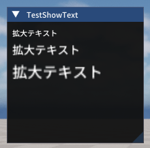
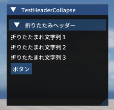

# ImGuiTester

ImGuiTesterは、UE5上でImGuiのテスト・流用を目的としたサンプルコード集です。

## 動作環境
- Unreal Engine 5.5.4
- VisualStudio 2022

### 使用しているImGuiについて
- [Unreal ImGuiプラグイン (benui-dev/UnrealImGui)：MIT License](https://github.com/benui-dev/UnrealImGui)  
  Unreal Engine 5 向けに Dear ImGui を統合するプラグイン。ImPlotなどの拡張にも対応。

- [Dear ImGui (Omar Cornut)：MIT License](https://github.com/ocornut/imgui)  
  軽量で移植性の高いGUIライブラリ。Unreal ImGuiはこのライブラリをUnreal Engineに対応させたもの。

## 主要ファイル
- `Source/ImGuiTester/Private/ImGuiActor.cpp`  
  ImGuiテスト用アクターの実装。サンプルコードは全てここ。
- `Plugins/ImGui/`  
  ImGuiプラグイン本体。日本語化対応のため一部変更を加えています。

## サンプルコード解説
- タイトルリンクからサンプルコードの場所に移動できます。

<table>
  <tr>
    <td></td>
    <td style="vertical-align:middle; padding-left:10px;">
      <a href="https://github.com/7jibi8rm/ImGuiTester/blob/master/Source/ImGuiTester/Private/ImGuiActor.cpp#L13-L29">No.1 ウィンドウ表示</a> 
      一番単純なウィンドウを表示するだけの例です。 
      ウィンドウを１つ作成し、３行分のテキストを表示します。 
    </td>
  </tr>
  <tr>
    <td></td>
    <td style="vertical-align:middle; padding-left:10px;">
      <a href="https://github.com/7jibi8rm/ImGuiTester/blob/master/Source/ImGuiTester/Private/ImGuiActor.cpp#L36-L61">No.2 ボタン作成</a> 
      単純なボタン配置の例です。 
      ウィンドウ１つにボタンを３つ配置、ボタンクリックで対応した値が変化します。 
    </td>
  </tr>
  <tr>
    <td></td>
    <td style="vertical-align:middle; padding-left:10px;">
      <a href="https://github.com/7jibi8rm/ImGuiTester/blob/master/Source/ImGuiTester/Private/ImGuiActor.cpp#L67-L94">No.3 様々なテキスト表示</a> 
      色変え等の特殊なテキストの例です。 
      変数の値埋め込み、グレーアウト、色指定のテキスト表示を行います。 
    </td>
  </tr>
  <tr>
    <td></td>
    <td style="vertical-align:middle; padding-left:10px;">
      <a href="https://github.com/7jibi8rm/ImGuiTester/blob/master/Source/ImGuiTester/Private/ImGuiActor.cpp#L102-L127">No.4 大きいテキスト表示</a> 
      スケールをかけたテキスト表示の例です。 
      ImGuiはフォントサイズ変更ができない。ウィンドウのスケールを変更して対応します。 
      厳密にやりたい場合、大きいフォント追加が必要。 
    </td>
  </tr>
  <tr>
    <td></td>
    <td style="vertical-align:middle; padding-left:10px;">
      <a href="https://github.com/7jibi8rm/ImGuiTester/blob/master/Source/ImGuiTester/Private/ImGuiActor.cpp#L135-L189">No.5 固定位置にウィンドウを表示する</a> 
      スクリーン中央・四隅にウィンドウを固定表示する例 
      直近のウィンドウ座標指定で位置を固定、ボタンで位置変更。 
    </td>
  </tr>
  <tr>
    <td></td>
    <td style="vertical-align:middle; padding-left:10px;">
      <a href="https://github.com/7jibi8rm/ImGuiTester/blob/master/Source/ImGuiTester/Private/ImGuiActor.cpp#L195-L219">No.6 チェックボックス</a> 
      チェックボックス配置の例です。 
      チェックボックスを３つ配置、状態を変数で管理し、その状態表示。 
    </td>
  </tr>
  <tr>
    <td></td>
    <td style="vertical-align:middle; padding-left:10px;">
      <a href="https://github.com/7jibi8rm/ImGuiTester/blob/master/Source/ImGuiTester/Private/ImGuiActor.cpp#L226-L251">No.7 スライダー</a> 
      スライダー配置の例です。 
      スライダーを３つ配置、浮動小数版・整数版・度数版の三種類。 
    </td>
  </tr>
  <tr>
    <td></td>
    <td style="vertical-align:middle; padding-left:10px;">
      <a href="https://github.com/7jibi8rm/ImGuiTester/blob/master/Source/ImGuiTester/Private/ImGuiActor.cpp#L259-L283">No.8 コンボボックス</a> 
      コンボボックス配置の例です。 
      3項目設定したコンボボックスを１つ配置。 
      補足、コンボボックスはプルダウン・ドロップダウンリストとも呼ばれる。 
    </td>
  </tr>
  <tr>
    <td></td>
    <td style="vertical-align:middle; padding-left:10px;">
      <a href="https://github.com/7jibi8rm/ImGuiTester/blob/master/Source/ImGuiTester/Private/ImGuiActor.cpp#L289-L304">No.9 テクスチャ表示</a> 
      コンテンツブラウザの画像を参照して表示する例です。 
      外部データ利用にはFImGuiModuleが必要。詳細はAImGuiActor::BeginPlayを確認。 
    </td>
  </tr>
  <tr>
    <td></td>
    <td style="vertical-align:middle; padding-left:10px;">
      <a href="https://github.com/7jibi8rm/ImGuiTester/blob/master/Source/ImGuiTester/Private/ImGuiActor.cpp#L311-L337">No.10 ラベル付き入力フィールド</a> 
      ユーザー入力可能なテキストフィールドを表示する例です。 
      ３つの入力フィールドを配置、通常・数字のみ・読み取り専用の３種類。 
    </td>
  </tr>
  <tr>
    <td></td>
    <td style="vertical-align:middle; padding-left:10px;">
      <a href="https://github.com/7jibi8rm/ImGuiTester/blob/master/Source/ImGuiTester/Private/ImGuiActor.cpp#L344-L384">No.11 テーブル</a> 
      テーブル表示の例です。 
      3列5行のテーブルを作成し、各セルに行列番号を表示します。 
    </td>
  </tr>
  <tr>
    <td></td>
    <td style="vertical-align:middle; padding-left:10px;">
      <a href="https://github.com/7jibi8rm/ImGuiTester/blob/master/Source/ImGuiTester/Private/ImGuiActor.cpp#L390-L423">No.12 ツリーノード</a> 
      ツリーノード表示の例です。 
      親ツリーと２つの子ツリー配置。ツリーノードは階層的なデータ構造の表現が可能。 
    </td>
  </tr>
  <tr>
    <td></td>
    <td style="vertical-align:middle; padding-left:10px;">
      <a href="https://github.com/7jibi8rm/ImGuiTester/blob/master/Source/ImGuiTester/Private/ImGuiActor.cpp#L430-L451">No.13 ツールチップ表示</a> 
      ツールチップを表示させる例です。 
      アイテムにマウスホバーでツールチップを表示。別名ポップアップヒント。 
    </td>
  </tr>
  <tr>
    <td></td>
    <td style="vertical-align:middle; padding-left:10px;">
      <a href="https://github.com/7jibi8rm/ImGuiTester/blob/master/Source/ImGuiTester/Private/ImGuiActor.cpp#L458-L484">No.14 カラーピッカー</a> 
      カラー選択メニューの例です。 
      RGBA各成分を調整可能なカラーピッカー・プレビュー表示を配置。 
    </td>
  </tr>
  <tr>
    <td></td>
    <td style="vertical-align:middle; padding-left:10px;">
      <a href="https://github.com/7jibi8rm/ImGuiTester/blob/master/Source/ImGuiTester/Private/ImGuiActor.cpp#L491-L511">No.15 プログレスバー</a> 
      プログレスバー表示の例です。 
      進捗率を表すプログレスバーを配置、進捗率は0.0〜1.0の範囲で指定。 
    </td>
  </tr>
  <tr>
    <td></td>
    <td style="vertical-align:middle; padding-left:10px;">
      <a href="https://github.com/7jibi8rm/ImGuiTester/blob/master/Source/ImGuiTester/Private/ImGuiActor.cpp#L519-L557">No.16 メニューバー追加</a> 
      ウィンドウにメニューバーを追加する例です。 
      ImGui::Beginにて、ImGuiWindowFlags_MenuBarを指定することでメニューバーを有効化。 
      メニューバーに「File」を追加し、その中に複数のアイテムを配置。 
    </td>
  </tr>
  <tr>
    <td></td>
    <td style="vertical-align:middle; padding-left:10px;">
      <a href="https://github.com/7jibi8rm/ImGuiTester/blob/master/Source/ImGuiTester/Private/ImGuiActor.cpp#L564-L594">No.17 タブバー</a> 
      タブ付きウィンドウを作成する例です。 
      タブバーを追加し２つのタブを配置。それぞれ内容を変化。 
    </td>
  </tr>
  <tr>
    <td></td>
    <td style="vertical-align:middle; padding-left:10px;">
      <a href="https://github.com/7jibi8rm/ImGuiTester/blob/master/Source/ImGuiTester/Private/ImGuiActor.cpp#L602-L631">No.18 スタイル変更</a> 
      ImGui内の様々なスタイルを変更する例です。 
      テキストカラーの変更を行います。他にも色々出来そうだが深追いしきれず…。要調査。 
    </td>
  </tr>
  <tr>
    <td></td>
    <td style="vertical-align:middle; padding-left:10px;">
      <a href="https://github.com/7jibi8rm/ImGuiTester/blob/master/Source/ImGuiTester/Private/ImGuiActor.cpp#L639-L664">No.19 フォーカス制御</a> 
      片方の入力フィールドを優先フォーカスする例です。 
      フォーカス関数は多々あるため、一番単純なキーボードのフォーカス制御を対応。 
      その他の応用的な制御は要調査。 
    </td>
  </tr>
  <tr>
    <td></td>
    <td style="vertical-align:middle; padding-left:10px;">
      <a href="https://github.com/7jibi8rm/ImGuiTester/blob/master/Source/ImGuiTester/Private/ImGuiActor.cpp#L671-L720">No.20 ドラッグ&ドロップ</a> 
      ドラッグ&ドロップの実装例です。 
      アイテムリストをドラッグ&ドロップで並び替え可能にしています。 
    </td>
  </tr>
  <tr>
    <td></td>
    <td style="vertical-align:middle; padding-left:10px;">
      <a href="https://github.com/7jibi8rm/ImGuiTester/blob/master/Source/ImGuiTester/Private/ImGuiActor.cpp#L727-L749">No.21 子ウィンドウ作成</a> 
      ウィンドウの中に子ウィンドウを作成する例です。 
      子ウィンドウはスクロール操作や、その中でUI要素を独立して管理できます。 
    </td>
  </tr>
  <tr>
    <td></td>
    <td style="vertical-align:middle; padding-left:10px;">
      <a href="https://github.com/7jibi8rm/ImGuiTester/blob/master/Source/ImGuiTester/Private/ImGuiActor.cpp#L756-L793">No.22 キーボード・マウス入力監視</a> 
      入力状態を監視する例です。 
      マウス位置、ボタン状態、キー押下状態を取得し表示します。 
    </td>
  </tr>
  <tr>
    <td></td>
    <td style="vertical-align:middle; padding-left:10px;">
      <a href="https://github.com/7jibi8rm/ImGuiTester/blob/master/Source/ImGuiTester/Private/ImGuiActor.cpp#L800-L829">No.23 画像ボタン</a> 
      画像付きボタンを配置する例です。 
      コンテンツブラウザの画像をテクスチャとして登録し、それをボタンに割り当てます。 
    </td>
  </tr>
  <tr>
    <td></td>
    <td style="vertical-align:middle; padding-left:10px;">
      <a href="https://github.com/7jibi8rm/ImGuiTester/blob/master/Source/ImGuiTester/Private/ImGuiActor.cpp#L836-L861">No.24 スペース調整</a> 
      ウィンドウ内のスペース調整の例です。 
      縦横のスペース調整、同一ライン配置を行います。 
    </td>
  </tr>
  <tr>
    <td></td>
    <td style="vertical-align:middle; padding-left:10px;">
      <a href="https://github.com/7jibi8rm/ImGuiTester/blob/master/Source/ImGuiTester/Private/ImGuiActor.cpp#L868-L898">No.25 行や列を分割配置</a> 
      カラムレイアウトの例です。 
      ウィンドウ内に3列レイアウトを作成し、各列にテキストを配置します。 
    </td>
  </tr>
  <tr>
    <td></td>
    <td style="vertical-align:middle; padding-left:10px;">
      <a href="https://github.com/7jibi8rm/ImGuiTester/blob/master/Source/ImGuiTester/Private/ImGuiActor.cpp#L905-L942">No.26 モーダルダイアログ</a> 
      ポップアップで出現するダイアログの例です。 
      ボタンを押すと優先フォーカスされたダイアログが表示されます。 
    </td>
  </tr>
  <tr>
    <td></td>
    <td style="vertical-align:middle; padding-left:10px;">
      <a href="https://github.com/7jibi8rm/ImGuiTester/blob/master/Source/ImGuiTester/Private/ImGuiActor.cpp#L949-L985">No.27 コピー&ペースト</a> 
      クリップボードを利用したコピー&ペーストの例です。 
      入力フィールドの文字列をクリップボードにコピーします。 
    </td>
  </tr>
  <tr>
    <td></td>
    <td style="vertical-align:middle; padding-left:10px;">
      <a href="https://github.com/7jibi8rm/ImGuiTester/blob/master/Source/ImGuiTester/Private/ImGuiActor.cpp#L992-L1010">No.28 ユーザーガイド表示</a> 
      ImGuiのユーザーガイドを表示する例です。 
      ヘルプメニューとして利用可能。ImGuiの基本的な操作方法が記載されています。 
    </td>
  </tr>
  <tr>
    <td></td>
    <td style="vertical-align:middle; padding-left:10px;">
      <a href="https://github.com/7jibi8rm/ImGuiTester/blob/master/Source/ImGuiTester/Private/ImGuiActor.cpp#L1018-L1059">No.29 ズーム/パン操作</a> 
      ズームとパン操作の例です。 
      マウスホイールでズームイン・ズームアウト、右ドラッグでパン操作が可能です。 
      描画領域に円を描画し、ズームとパンを反映します。 
    </td>
  </tr>
  <tr>
    <td></td>
    <td style="vertical-align:middle; padding-left:10px;">
      <a href="https://github.com/7jibi8rm/ImGuiTester/blob/master/Source/ImGuiTester/Private/ImGuiActor.cpp#L1066-L1107">No.30 キャンバス描画</a> 
      ウィンドウ上にラインを描画する例です。 
      マウスクリックでポイントを追加し、ポイントを直線で結びます。 
    </td>
  </tr>
  <tr>
    <td></td>
    <td style="vertical-align:middle; padding-left:10px;">
      <a href="https://github.com/7jibi8rm/ImGuiTester/blob/master/Source/ImGuiTester/Private/ImGuiActor.cpp#L1114-L1165">No.31 スクロー位置操作</a> 
      スクロール位置を直接設定する例です。 
      ２つのChildウィンドウを横並びに配置し、スクロール位置を同期させます。 
    </td>
  </tr>
  <tr>
    <td></td>
    <td style="vertical-align:middle; padding-left:10px;">
      <a href="https://github.com/7jibi8rm/ImGuiTester/blob/master/Source/ImGuiTester/Private/ImGuiActor.cpp#L1172-L1203">No.32 フィルタリングリスト</a> 
      フィルタ操作可能なアイテムリストの例です。 
      テキスト入力でフィルタを指定し、マッチするアイテムのみ表示します。 
    </td>
  </tr>
  <tr>
    <td></td>
    <td style="vertical-align:middle; padding-left:10px;">
      <a href="https://github.com/7jibi8rm/ImGuiTester/blob/master/Source/ImGuiTester/Private/ImGuiActor.cpp#L1209-L1251">No.33 複数選択リストボックス</a> 
      複数選択可能なリストボックスの例です。 
    </td>
  </tr>
  <tr>
    <td></td>
    <td style="vertical-align:middle; padding-left:10px;">
      <a href="https://github.com/7jibi8rm/ImGuiTester/blob/master/Source/ImGuiTester/Private/ImGuiActor.cpp#L1258-L1276">No.34 マルチライン入力</a> 
      マルチラインテキスト入力フィールドの例です。 
      ImGui::InputTextMultilineを使用して複数行のテキスト入力を可能にします。 
    </td>
  </tr>
  <tr>
    <td></td>
    <td style="vertical-align:middle; padding-left:10px;">
      <a href="https://github.com/7jibi8rm/ImGuiTester/blob/master/Source/ImGuiTester/Private/ImGuiActor.cpp#L1283-L1308">No.35 数値ステッパー</a> 
      値を増減できる入力フィールドの例です。 
      ＋－ボタン、マウスドラッグ型の入力フィールドを2種類配置します。 
    </td>
  </tr>
  <tr>
    <td></td>
    <td style="vertical-align:middle; padding-left:10px;">
      <a href="https://github.com/7jibi8rm/ImGuiTester/blob/master/Source/ImGuiTester/Private/ImGuiActor.cpp#L1315-L1363">No.36 図形描画</a> 
      回転とスケールを適用した四角形描画の例です。 
      スライダーで回転角度とスケールを調整し、四角形を変形して描画します。 
    </td>
  </tr>
  <tr>
    <td></td>
    <td style="vertical-align:middle; padding-left:10px;">
      <a href="https://github.com/7jibi8rm/ImGuiTester/blob/master/Source/ImGuiTester/Private/ImGuiActor.cpp#L1370-L1389">No.37 パスワード入力</a> 
      パスワード入力フィールドの例です。 
      入力内容を'*'で表示される入力フィールドを配置します。 
    </td>
  </tr>
  <tr>
    <td></td>
    <td style="vertical-align:middle; padding-left:10px;">
      <a href="https://github.com/7jibi8rm/ImGuiTester/blob/master/Source/ImGuiTester/Private/ImGuiActor.cpp#L1394-L1398">No.38 音声再生UI（未対応）</a> 
    </td>
  </tr>
  <tr>
    <td></td>
    <td style="vertical-align:middle; padding-left:10px;">
      <a href="https://github.com/7jibi8rm/ImGuiTester/blob/master/Source/ImGuiTester/Private/ImGuiActor.cpp#L1403-L1407">No.39 動画再生UI（未対応）</a> 
    </td>
  </tr>
  <tr>
    <td></td>
    <td style="vertical-align:middle; padding-left:10px;">
      <a href="https://github.com/7jibi8rm/ImGuiTester/blob/master/Source/ImGuiTester/Private/ImGuiActor.cpp#L1414-L1454">No.40 タグ選択風UI</a> 
      SmallButtonを利用したタグ選択風UIの例です。 
      複数のタグボタンを配置し、選択状態をトグルで判定しています。 
    </td>
  </tr>
  <tr>
    <td></td>
    <td style="vertical-align:middle; padding-left:10px;">
      <a href="https://github.com/7jibi8rm/ImGuiTester/blob/master/Source/ImGuiTester/Private/ImGuiActor.cpp#L1461-L1485">No.41 ヘッダーで折りたたみ</a> 
      折りたたみ可能なブロックを配置する例です。 
      ヘッダー部分をクリックすると内容が展開・折りたたまれます。 
    </td>
  </tr>
  <tr>
    <td></td>
    <td style="vertical-align:middle; padding-left:10px;">
      <a href="https://github.com/7jibi8rm/ImGuiTester/blob/master/Source/ImGuiTester/Private/ImGuiActor.cpp#L1492-L1534">No.42 行数・カラム数変更可能テーブル</a> 
      ImGuiのテーブル機能を応用した例です。 
      スライダーで行数・カラム数を動的に変更し、テーブルの内容を更新します。 
    </td>
  </tr>
  <tr>
    <td></td>
    <td style="vertical-align:middle; padding-left:10px;">
      <a href="https://github.com/7jibi8rm/ImGuiTester/blob/master/Source/ImGuiTester/Private/ImGuiActor.cpp#L1541-L1581">No.43 折れ線グラフ</a> 
      ImDrawListを使ってウィンドウ内に折れ線グラフを描画します。 
      カスタム描画の工夫によりグラフを実現しています。グラフ機能が存在するわけではありません。 
    </td>
  </tr>
  <tr>
    <td></td>
    <td style="vertical-align:middle; padding-left:10px;">
      <a href="https://github.com/7jibi8rm/ImGuiTester/blob/master/Source/ImGuiTester/Private/ImGuiActor.cpp#L1588-L1629">No.44 テーマ切替</a> 
      テーマ切り替え用メソッドのテストです。 
      ダーク・ライト・クラシック・カスタムテーマの4種類への切り替えを行います。 
    </td>
  </tr>
  <tr>
    <td></td>
    <td style="vertical-align:middle; padding-left:10px;">
      <a href="https://github.com/7jibi8rm/ImGuiTester/blob/master/Source/ImGuiTester/Private/ImGuiActor.cpp#L1637-L1663">No.45 マウスカーソルカスタマイズ</a> 
      マウスカーソルの形を変更する方法の例です。 
      ホバー時は左右リサイズ用のカーソル、通常時は矢印カーソルを表示します。 
      ImGui::SetMouseCursor()によりカーソル形状を変更しています。 
    </td>
  </tr>
  <tr>
    <td></td>
    <td style="vertical-align:middle; padding-left:10px;">
      <a href="https://github.com/7jibi8rm/ImGuiTester/blob/master/Source/ImGuiTester/Private/ImGuiActor.cpp#L1671-L1740">No.46 行の並び替え</a> 
      テーブルソート機能を利用したシンプルなサンプル。 
      ソート可能なテーブルで行データ（ID・名前・値）を表示します。 
      ヘッダークリックで昇順・降順の並び替えができます。 
    </td>
  </tr>
</table>

## ライセンス
This project is licensed under the MIT License. See the LICENSE file for details.

